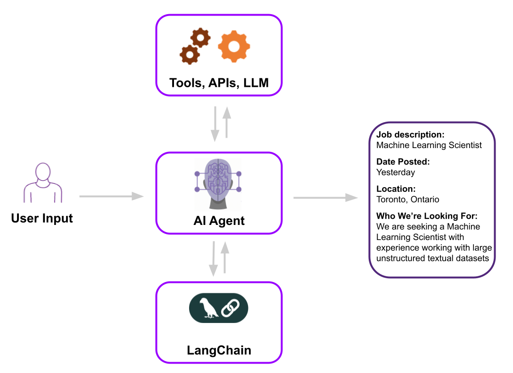

# AI agent for job search using LangChain

An AI agent is a specialized software solution built on top of large language models (LLMs) and fine-tuned to automate specific, critical tasks across various industries. Examples include: 
- AI tax accountant that manages tax preparation and advisory services,
- AI medical biller that handles patient records and submits claims,
- AI phone support agent that responds to customer inquiries in real-time,
- AI compliance agent that ensures regulatory adherence, and an AI quality assurance tester that automates software testing processes. 

These agents enhance efficiency by focusing on niche areas, and providing accurate and effective solutions. Here, I have developed an AI agent capable of utilizing multiple tools for efficient job searching and company research. The agent leverages LangChain, OpenAI’s chat models, and external tools such as Google Jobs and Wikipedia search to retrieve structured information about job openings. A LangChain agent consists of various components, including chat LLM models, prompt templates, external tools, and other integrations.

I have implemented a ReAct agent (reason and act), which offers a more structured approach to building AI systems. The agent is provided with specific instructions, such as acting as a recruiter or an assistant, and generates responses based on user queries. By interacting with real-world data sources, it ensures dynamic and real-time functionality. The results demonstrate how the agent selects the appropriate tool—such as Wikipedia for answering company-related queries or Google Jobs for job searches—based on the prompt given to the LLM chat model.

  

